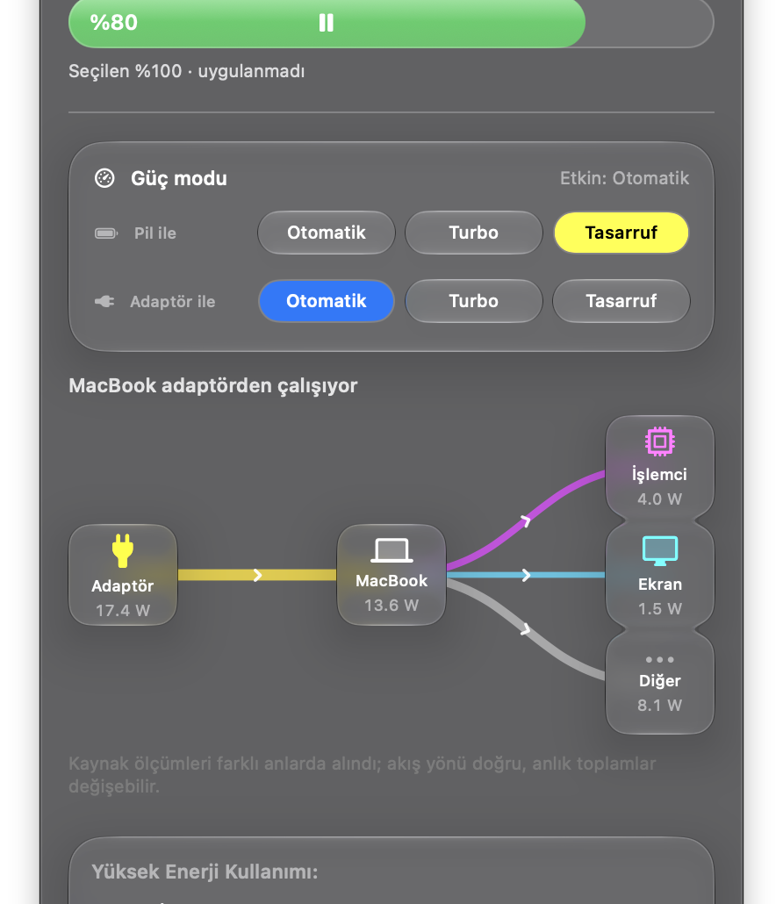

# Cellkeep

🇬🇧 [English README](README.md)

MacBook'unuzun bataryasına göz kulak olan bir macOS menü çubuğu uygulaması: yerel şarj sınırı, canlı güç akışı görünümü ve geçmiş grafikleri — her şeyi izleyen bir arka plan servisi olmadan.

> Cellkeep, daha önce "ChargeMate" adıyla geliştirildi. Aşağıdaki bazı dosya yolları, etiketler ve ekran görüntüleri yeni isme geçiş sürecindedir.

## Ekran görüntüleri

<p align="center"></p>

## Özellikler

- **%80–100 şarj sınırı.** Cellkeep, macOS'un kendi yerel şarj sınırı mekanizmasını (macOS Ayarlar'ın kullandığı aynı mekanizma) sürerek bataryayı %80 ile %100 arasında, %5'lik adımlarla bir hedefte tutar. Bir sınır uygulamak, bağımsız bir geri-okuma kontrolüyle doğrulanan gerçek bir okuma/yazma turudur — bunun ne kanıtlayıp ne kanıtlamadığı için [Sınırlamalar](#nasıl-çalışır-ve-sınırları) bölümüne bakın.
- **Doldur (Top Up).** Bir seyahat için geçici olarak %100'e şarj eder; ardından Cellkeep önceki sınırınızı geri yükler.
- **Canlı güç akışı.** Adaptör, batarya, işlemci, ekran ve "diğer" gücün watt cinsinden diyagramı. İşlemci ve ekran watt değerleri Apple'ın SMC sensörlerinden, toplam sistem gücü ise batarya denetleyicisinden okunur. Hiçbir değer tahmin edilmez veya uydurulmaz; ölçülemiyorsa "—" gösterilir.
- **Bağlı cihaz gücü.** Tam olarak tek bir USB cihazı tek bir aktif portta güç çekiyorsa, Cellkeep o cihazın watt değerini gösterir (batarya denetleyicisinin port telemetrisinden, salt-okunur). Birden fazla cihaz veya port varsa tahmin yerine "—" gösterilir.
- **Geçmiş grafikleri.** Şarj seviyesi, güç tüketimi ve batarya sağlığı için 1 saat / 6 saat / 24 saatlik görünümler.
- **Batarya sağlığı.** Günlük sensör gürültüsünün gerçek bir sağlık değişimi gibi görünmemesi için saatlik medyana yumuşatılmış maksimum kapasite grafiği.
- **Kaynağa göre güç modları.** Otomatik / Yüksek Güç (Turbo) / Tasarruf, "pilde" ve "adaptörde" ayrı ayrı izlenir; macOS'un kendi `pmset` güç profillerine, dar kapsamlı ve izin listeli bir yardımcı üzerinden yazılır.
- **Uyku davranışı.** İsteğe bağlı: adaptör bağlıyken ve hedefin altında şarj olurken, Cellkeep genel (public) bir macOS boşta-uyku assertion'ı tutarak Mac'inizin uykuya geçmek yerine şarj olmaya devam etmesini sağlar. 8 saatlik güvenlik sınırı vardır; kapak kapatma veya ekran uykusuna hiç dokunmaz. Uyku sırasında şarjı kendiliğinden duraklatmaz — bkz. Sınırlamalar.
- **MagSafe LED denetimi.** İmzalı, dar kapsamlı ve yalnızca bilinen tek bir SMC anahtarına yazan bir ayrıcalıklı yardımcı üzerinden manuel Sistem / Yeşil / Turuncu / Kapalı denetimi, artı her zaman kapalı veya saatli bir politika.
- **Zamanlamalar (Schedules).** Bir sınır uygulama, güç modu değiştirme ve benzeri için tekrarlı veya tek seferlik eylemler; filtrelenebilir çalıştırma geçmişiyle.
- **Apple Kısayolları (Shortcuts) eylemleri.** Pil yüzdesi, sıcaklık ve durum okuma; sınır uygulama, Doldur başlatma/iptal etme, güç modu değiştirme veya MagSafe LED ayarlama için sekiz App Intent.
- **Çıkış ile yüksek enerjili uygulamalar.** Enerji listesi yardımcı süreçleri sahibi uygulama altında toplar, gerçek ikonu gösterir ve listeden doğrudan bir uygulamayı kapatmanıza izin verir.
- **İsteğe bağlı güncelleme haberi.** Varsayılan olarak kapalıdır. Ayarlar → Hakkında'dan açılırsa Cellkeep haftada en fazla bir kez GitHub'dan son sürüm numarasını sorar ve sayfasına bağlantı verir. Hiçbir şey indirilmez veya gönderilmez; bkz. [PRIVACY.md](PRIVACY.md).
- **Çakışma koruması.** Başka bir şarj limiti aracı çalışıyor ya da kuruluysa (AlDente, Battery Toolkit, BatFi, batt, battery, bclm) Cellkeep izlemeye devam eder ama kendi limit yazmalarını kilitler; iki uygulama aynı ayar için çekişmez.
- **Diller.** İngilizce, Türkçe, Almanca, Fransızca ve İspanyolca; Cellkeep macOS dilinizi izler, desteklenmeyen dillerde İngilizceye döner.
- **Özelleştirilebilir panel.** Sürükleyerek sıralama, kart ekleme/çıkarma, kare veya geniş widget seçimi.

### Planlanan; donanımda doğrulama gerekiyor

Bunlar arayüzde kilitli olarak ve **"Yakında"** etiketiyle görünür. Bunlar **çalışan özellikler değildir** — henüz bir şey yapmalarını beklemeyin:

- **Deşarj / otomatik deşarj** — bu donanımda bataryayı zorla deşarj etmenin doğrulanmış bir yolu yok.
- **Sailing** (bir aralıkta salınım) — bulunamayan çalışan bir duraklat/devam ettir (pause/resume) ilkeli gerektiriyor.
- **Isı koruması** — aynı duraklat/devam ettir ilkeli artı taze sıcaklık verisi gerektiriyor.
- **Kalibrasyon** — uzun süreli, geri alınabilir bir deşarj/şarj döngüsü; uygulanmadı.

## Gereksinimler

- **Yalnız Apple Silicon (arm64).**
- **macOS 27**'de, tek bir Mac modelinde test edildi. Diğer macOS sürümleri ve diğer Mac modelleri **test edilmedi** — çalışabilir, derlenemeyebilir veya sessizce hatalı davranabilir. Farklı bir modelde denerseniz lütfen Mac modelinizi ve macOS sürümünüzü belirterek bir issue açın.

## Kurulum

1. En son `.dmg` dosyasını [Releases](../../releases)'tan indirin.
2. Açın ve Cellkeep'i Applications'a sürükleyin.
3. İlk açılışta, uygulama henüz notarize edilmediyse macOS bilinmeyen geliştirici uyarısı verebilir — Sistem Ayarları → Gizlilik ve Güvenlik'ten izin verin.
4. Ayrıcalıklı bir yardımcı gerektiren bir özelliği (güç modu değiştirme veya MagSafe LED denetimi) ilk kullandığınızda, macOS o yardımcı için bir kez yönetici onayı ister. Cellkeep parola saklamaz.

## Kaynaktan derleme

Xcode 27 gerektirir.

```sh
./check.sh
./build.sh
```

`check.sh` saf mantık test paketini çalıştırır. `build.sh` `.build/Cellkeep.app` dosyasını üretir.

## Kaldırma

Uygulama içinden (önerilen): Ayarlar → Genel → **"Cellkeep'i kaldır"**. Tek bir yönetici onayıyla yardımcıları ve arka plan servislerini kaldırır, giriş öğesini siler, isterseniz macOS şarj sınırını %100'e döndürür (varsayılan açık) ve Cellkeep verilerini siler (varsayılan kapalı). Ardından `Cellkeep.app`'i Çöp Sepeti'ne sürükleyin.

Elle kaldırma:

1. Önce Cellkeep'ten çıkın ve Ayarlar'da "Oturum açılışında başlat"ı kapatın.
2. `Cellkeep.app`'i `/Applications`'tan Çöp Kutusu'na taşıyın.
3. Kuruluysa ayrıcalıklı yardımcıları kaldırın:
   ```sh
   sudo launchctl bootout system/io.github.berkinefeavci.cellkeep.powermode 2>/dev/null
   sudo launchctl bootout system/io.github.berkinefeavci.cellkeep.led 2>/dev/null
   sudo rm -f /Library/LaunchDaemons/io.github.berkinefeavci.cellkeep.powermode.plist
   sudo rm -f /Library/LaunchDaemons/io.github.berkinefeavci.cellkeep.led.plist
   sudo rm -f /Library/PrivilegedHelperTools/io.github.berkinefeavci.cellkeep.powermode
   sudo rm -f /Library/PrivilegedHelperTools/io.github.berkinefeavci.cellkeep.led
   ```
4. Cellkeep kaldırılırken macOS şarj sınırınızı değiştirmez — sınır bir Cellkeep süreci değil, bir macOS ayarıdır. İsterseniz Sistem Ayarları → Batarya'dan kendiniz kapatın.

## Nasıl çalışır ve sınırları

Cellkeep, Apple'ın özel `PowerUI` çerçevesi (macOS'un kendi Batarya ayarlarının kullandığı aynı alt sistem) üzerinden okuma/yazma yapar ve az sayıda belgelenmiş, salt-okunur SMC anahtarı okur. Bu genel (public), kararlı bir API değildir: **bir macOS güncellemesi bunu önceden haber vermeden bozabilir** ve Cellkeep'in bunu önceden tespit etmesinin bir yolu yoktur.

En önemli sınırlama: **bir şarj sınırı uygulamak, bağımsız bir geri-okumayla doğrulanmış bir yapılandırma yazmasıdır — fiziksel şarj akımının gerçekten o yüzdede durduğunun kanıtı değildir.** Cellkeep, macOS'un istenen sınırı kabul ettiğini ve geri bildirdiğini doğruladı; ancak akımın gerçekten kesildiğini doğrulayan kontrollü bir fiziksel deney (pil hedefin üzerinde, şarj kablosu takılı, rakip denetleyiciler kapalı) henüz çalıştırılmadı. Sınırı "macOS ayarlandığını söylüyor" olarak görün, bir garanti olarak değil.

Her yerde aynı kural geçerlidir: bir değer ölçülemiyorsa Cellkeep onu uydurmak yerine "—" gösterir. Görüntülemek için hiçbir ölçüm uydurulmaz veya aradeğerlemeyle üretilmez.

## Gizlilik

Cellkeep tamamen Mac'inizde çalışır. Telemetri, analitik veya hesap yoktur. Tek ağ isteği, varsayılan olarak kapalı olan isteğe bağlı sürüm denetimidir; bkz. [PRIVACY.md](PRIVACY.md). Dışa aktardığınız tanılama raporları yalnızca seçtiğiniz yerel bir dosyaya kaydedilir ve hiçbir yere otomatik gönderilmez.

Bkz. [PRIVACY.md](PRIVACY.md).

## Katkıda bulunma

Issue ve pull request'ler için teşekkürler — build/test komutları ve donanıma yazan kod etrafındaki kurallar için [CONTRIBUTING.md](CONTRIBUTING.md) dosyasına bakın.

Cellkeep işinize yarıyorsa: <!-- TODO: Buy Me a Coffee bağlantısı --> ☕

## Güvenlik

Bir güvenlik açığı mı buldunuz? Lütfen [SECURITY.md](SECURITY.md) dosyasına bakın — herkese açık bir issue açmayın.

## Lisans

MIT — bkz. [LICENSE](LICENSE).
